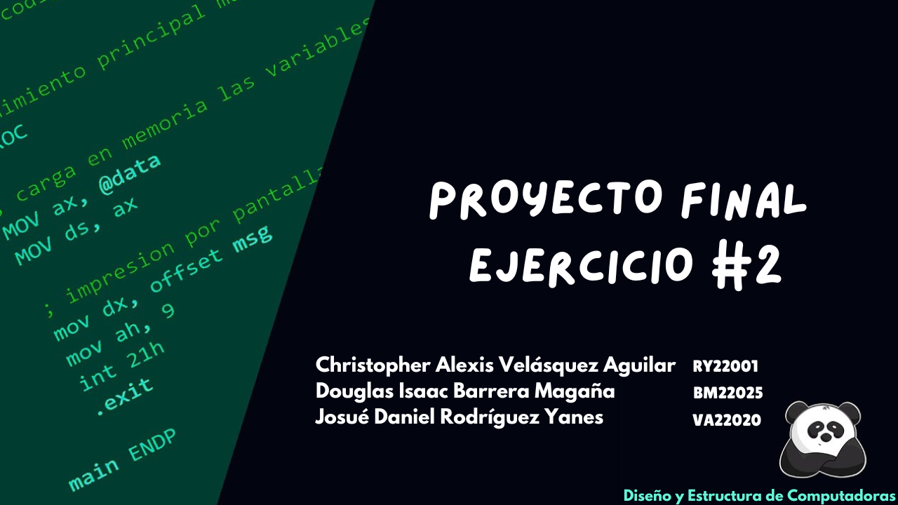

<div align="center">
  
  <h1>Ejercicio #2</h1>
  <h3>Captura y cálculo de la traspuesta de una matriz de 3x3</h3>
</div>

## 📢 Enunciado

- Los elementos de la matriz deberán de ser ingresados por medio
  del teclado.

- Deberá de realizar validaciones para evitar operaciones
  invalidadas como por ejemplo el ingreso de un carácter diferente
  de números del 0 al 9.
- Aplicar el uso de macro o etiquetas en la llamada y trasferencia
  de control de las instrucciones a ejecutar.

## 🗃️ Estructura

En la carpeta **program** encontrarás la siguiente estructura:

- `archivo.c`: Este archivo contiene el código fuente en lenguaje C con ensamblador.
- `archivo sin extensión`: Archivo ejecutable (mediante la terminal)

## 🛠️ Ejecución 

Para ejecutar el programa, sigue estos pasos:

1. Clona o descarga el repositorio
   
2. Abre una terminal y navega al directorio principal del repositorio
   es decir, a la carpeta que contiene todos los archivos del proyecto
  
3. Dentro del directorio principal del repositorio, dirígete a la carpeta `program`

4. En tu terminal, escribe el siguiente comando
   
    ```bash
    ./proyecto
    ```
    
¡Y eso es todo! Una vez que hayas ejecutado este comando, el archivo correspondiente se ejecutará en tu terminal
